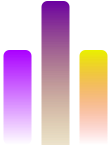

* Qyburn

A simple quantum-powered music concert experience that turns quantum computations into beautiful audio-visual performances.

**What it does:**
- Generates musical notes using quantum algorithms (superposition, entanglement, interference)
- Creates stunning real-time audio visualizations with multiple display modes
- Controls LED lights that sync with the quantum-generated music
- Combines cutting-edge quantum computing with live performance art

**How it works:**
- =server.py= runs quantum circuits to generate musical note sequences
- =client.py= visualizes the music with pygame and provides interactive controls
- =firmware.py= controls physical LEDs to create a synchronized light show

**Try it out:**
Run =python src/server.py= to see quantum music generation in action, or =python src/client.py= for the full audio-visual experience.

Submitted to the [[https://uoquantum.com][Qiskit Fall Fest 2025]] @ [[https://www.uottawa.ca/en][University of Ottawa]], Ontario by Quotify - Surya Vasudev, Marcel Traore, and Mumtahin Farabi.
